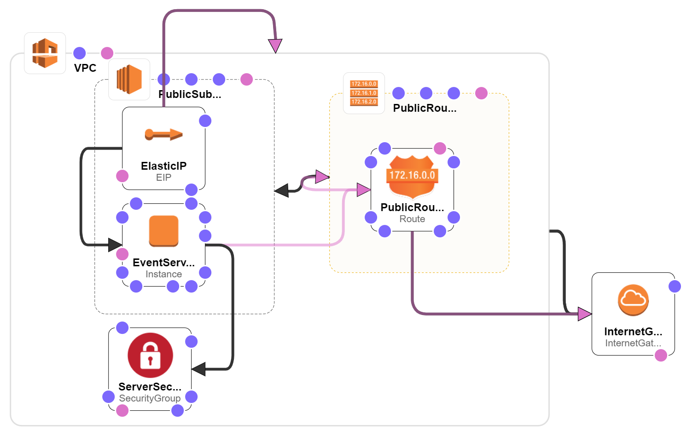
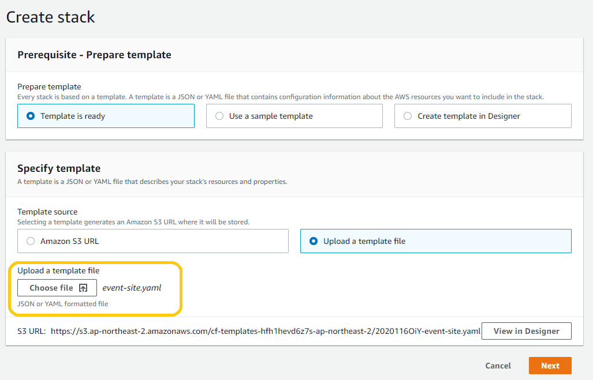
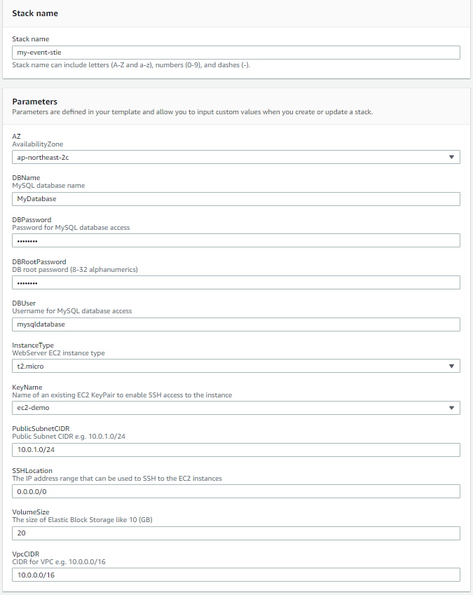
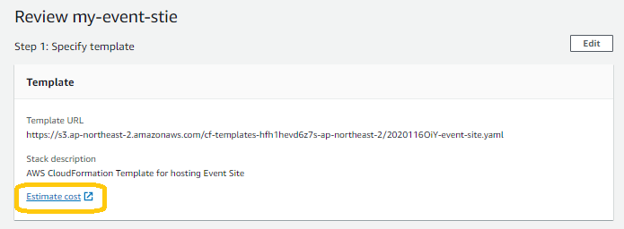

<h1>Template: 이벤트 사이트</h1>

<h2>이벤트 사이트 개요</h2>

이 템플릿은 이벤트 사이트를 호스팅하기 위한 템플릿입니다.

사이트 특징은 다음과 같습니다:

<ul>
    <li>1개월 한정으로 이용합니다.</li>
    <li>사이트 사용자는 개인 사용자로서 인터넷으로 접속합니다.</li>
    <li>비용을 우선하며 다중화나 백업은 고려하지 않습니다.</li>
    <li>이벤트 사이트는 Amazon Linux2 OS에 LAMP 환경으로 구성되어 있습니다.</li>
</ul>

도메인 설정을 위한 Route53은 필요시 따로 설정하시면 됩니다.

<h2>아키텍처 구성도</h2>

<h2>어떻게 사용하는가</h2>
<h3>1. event-site.yaml 파일을 업로드합니다.</h3>

 

<h3>2. 본인의 event-site 구성에 맞게 파라미터를 적용합니다.</h3>

 

<h3>3. event-site 리소스에 대한 예상되는 비용을 산출할 수 있습니다.</h3>

